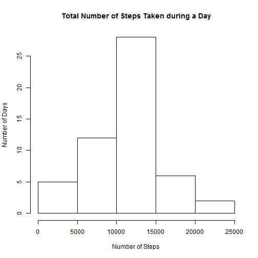
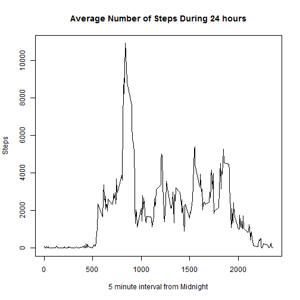

## Reproducible Research Assignment 1
### Loading and preprocessing data
1. Download data from https://d396qusza40orc.cloudfront.net/repdata%2Fdata%2Factivity.zip 
2. Unzip the file using standard platform tooling
3. load data


```r
activityData <- read.csv("activity.csv")
```

### Information on total number of steps taken per day
Plot of frequency of total number of steps taken during a day

```r
summarySteps <- aggregate(activityData$steps ~activityData$date,data = activityData, sum)
meanTotalSteps <- mean(summarySteps[,2])
medianTotalSteps <- median(summarySteps[,2])
hist(summarySteps[,2],main="Total Number of Steps Taken during a Day",xlab="Number of Steps",ylab="Number of Days")
```

 
mean number of steps per day	1.0766189 &times; 10<sup>4</sup>

median number of steps per day 	10765

### Information on average daily activity pattern 
Plot of number of steps taken on average during each five minute interval

```r
summaryIntervals <- aggregate(activityData$steps ~activityData$interval,data = activityData, sum)
names(summaryIntervals) <- rbind("Intervals","Steps")
plot(summaryIntervals,type='l',main = "Average Number of Steps During 24 hours",xlab="5 minute interval from Midnight")
```

 

```r
maxSteps <- max(summaryIntervals$Steps)
intervalMaxSteps <- summaryIntervals[(summaryIntervals[,2]==maxSteps),1]
```
Maximum average number of steps taken during five minute interval 10927. 
The maximum average number of steps occurred during interval 835.

### Impute missing values
Use the mean value of the five minute time interval if there is no value in the data set for the number of steps


```r
numberNA <- sum(is.na(activityData[,1]))
listNA <- is.na(activityData[,1])
updatedActivityData <- activityData
numberIntervals <- dim(activityData)[1]
for (n in 1:numberIntervals)
	{
	if (listNA[n])
		{
		updatedActivityData[n,1] <-  summaryIntervals[(updatedActivityData[n,3] == summaryIntervals[,1]),2]
		}
	}
```

Plot of frequency of total number of steps taken during a day having imputed any missing number of steps


```r
summaryStepsImputed <- aggregate(updatedActivityData$steps ~ updatedActivityData$date,data = updatedActivityData, sum)
meanTotalStepsImputed <- mean(summaryStepsImputed[,2])
medianTotalStepsImputed <- median(summaryStepsImputed[,2])
hist(summarySteps[,2],main="Total Number of Steps Taken during a Day",xlab="Number of Steps",ylab="Number of Days")
```

 

```r
diffmean <- meanTotalStepsImputed - meanTotalSteps
diffmedian <- medianTotalStepsImputed - medianTotalSteps
```
mean number of steps per day using imputed data		8.4188066 &times; 10<sup>4</sup>

median number of steps per day using imputed data 	11458

mean difference between raw data and data with no missing values 	7.3421877 &times; 10<sup>4</sup>

median difference between raw data and data with no missing vlaues 	693

### Average steps for interval during week days versus week ends
Add weekday or weekend to imputed data

```r
week_days <- weekdays(as.Date(updatedActivityData$date,format ="%Y-%m-%d"))
weekdayActivityData <- cbind(updatedActivityData,week_days)
weekend <- (week_days == "Saturday" | week_days == "Sunday")
weekend_factor <- factor(weekend,labels = c("Weekday","Weekend"))
weekdayActivityData <- cbind(weekdayActivityData,weekend_factor)
weekend_steps <- aggregate(weekdayActivityData$steps ~ weekdayActivityData$interval + weekdayActivityData$weekend_factor,data = weekdayActivityData, sum)
```
Plot results

```r
names(weekend_steps) <- c("intervals","time","average_steps")
q <-qplot(intervals,average_steps,data=weekend_steps,geom="line",colour=time)
```

```
## Error in eval(expr, envir, enclos): could not find function "qplot"
```

```r
print(q)
```

```
## function (save = "default", status = 0, runLast = TRUE) 
## .Internal(quit(save, status, runLast))
## <bytecode: 0x0000000010fccd98>
## <environment: namespace:base>
```
